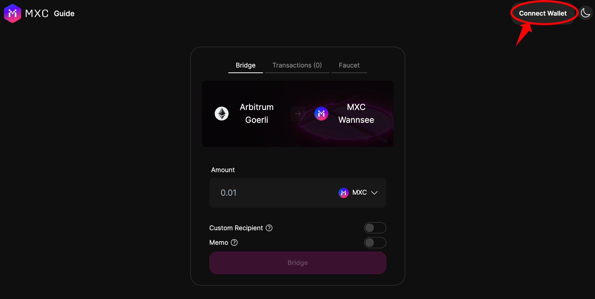
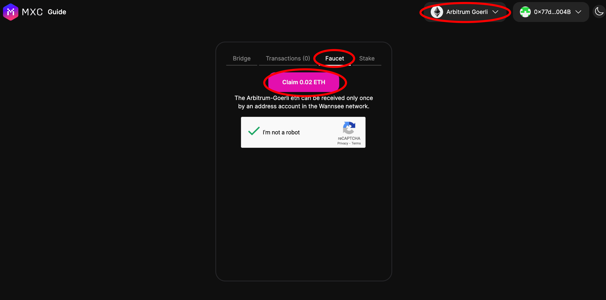
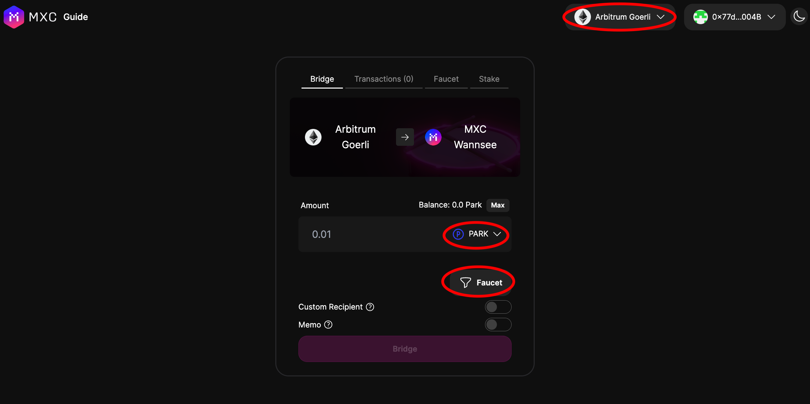
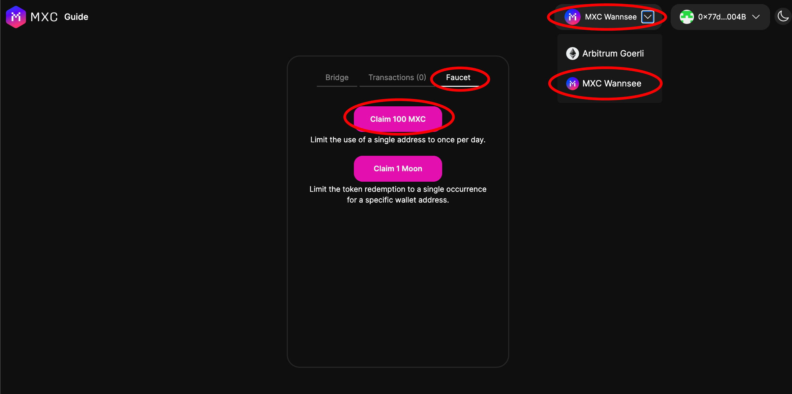
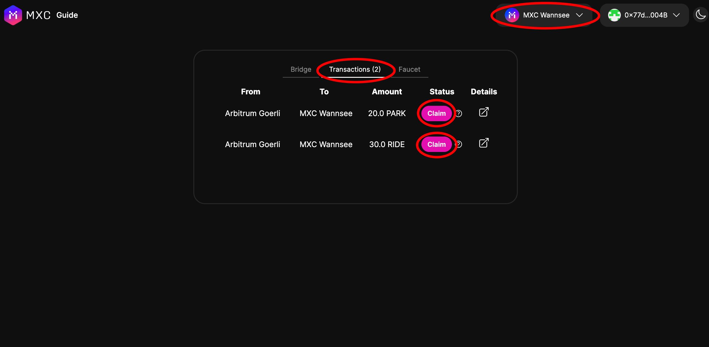

This guide will help you receive testnet tokens for Wannsee testnet and Arbitrum Goerli from the faucet(s).

> MXC token is the gas token of MXC (Wannsee testnet). The MXC token is used for paying L2 gas fee.

> Arbitrum Goerli ETH is used for gas/transaction fee on Arbitrum Goerli Testnet.

> The Ride token and Park token are both test tokens that are used for testing the bridge and swap.

## Prerequisites

- You should already have an Ethereum wallet address to accept the testnet tokens. Metamask wallet is preferred.

## Steps

### 1. Navigate to Bridge & Connect Your Wallet
- Make sure your wallet is on Arbitrum Goerli network
- Navigate to the [MXC Wannsee bridge](https://wannsee-bridge.mxc.com)
- Click on the Connect Wallet button to connect your wallet

### 2. Claim & Receive Goerli ETH on Arbitrum Goerli
- Make sure you are on Arbitrum Goerli network
- Click on the Faucet tab
- Check I'm not a robot
- Click the Claim 0.02 ETH button

### 3. Mint and Receive MXC, Ride or Park Test Token on Arbitrum Goerli
- Select any of the tokens (MXC, Ride or Park) from the dropdown
- Click on the Faucet button below the dropdown (The Faucet button is only visible if you haven't minted the selected token)
- Onclick of the Faucet button, a modal will pop up, click the Mint button
- Once minted, the Faucet button will disappear, you can select another token and repeat the process

### 4.  Bridge Token from Arbitrum Goerli to MXC Wannsee L2
- After minting token on Arbitrum Goerli network
- Select one of the minted token to bridge
- Input the amount of token to bridge
- Approve the token and bridge

### 5.  Claim & Receive MXC Test Token on MXC Wannsee L2
After bridging you will need to claim the token(s) you bridged on MXC WannSee L2 and you need MXC token to pay for the transaction
- At the top right of the page beside your wallet address, Click the dropdown and select MXC Wannsee
- Switch network to MXC Wannsee
- Click on the Faucet tab
- Claim MXC token on MXC Wannsee L2

### 6. Claim the bridged token(s) on MXC Wannsee L2
Now that you have MXC token on MXC Wannsee L2, you can pay transaction fees and claim your bridged tokens
- Click on the Transaction tab
- You will see a list of transactions based on the number of bridge transactions you did
- Click on the claim button of any of the tokens you want to claim

You have successfully received tokens on both Arbitrum Goerli, MXC Wannsee L2, and have also bridged tokens from Arbitrum to MXC Wannsee L2.