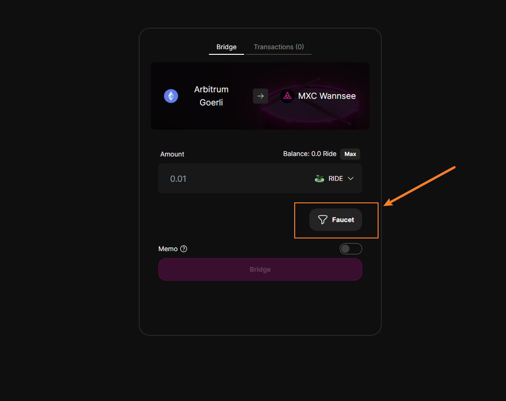

This guide will help you receive testnet tokens from the faucet(s).

> MXC token is the gas token of MXC (Wannsee testnet). The MXC token is used for paying L2 gas fee.

> The Ride token and Park token are both test tokens that are used for testing the bridge and swap.

## Prerequisites

- You have an Ethereum wallet address to accept the testnet tokens.

## Steps

### 1. Receive Goerli ETH
Visit one the faucets to receive ETH on Goerli:
  - #1 recommended: [https://goerli-faucet.pk910.de](https://goerli-faucet.pk910.de/)
  - #2 recommended: [https://goerlifaucet.com/](https://goerlifaucet.com/)

### 2. Bridge Goerli ETH to Arbitrum Goerli
1. Make Sure You Have Enough Goerli ETH (least 0.2 ETH)
2. Switch your wallet network to Goerli testnet or Arbitrum Goerli testnet
3. Use the [Arbitrum offcial bridge](https://bridge.arbitrum.io/?l2ChainId=421613) to bridge your Goerli ETH to Arbitrum Goerli ETH.

### 3. Receive MXC, Ride, Park Test Token

Navigate to the [MXC Wannsee bridge](https://wannsee-bridge.mxc.com), select one of token from the dropdown, and click "Faucet".

