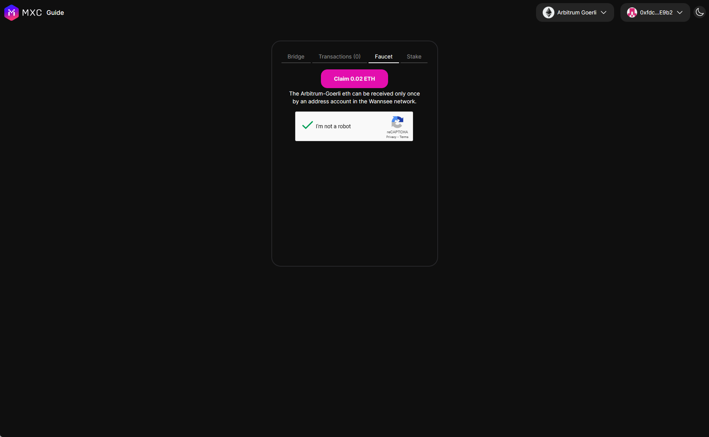
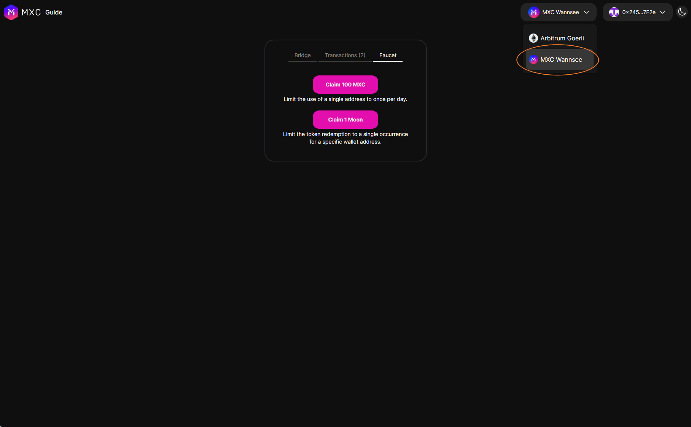
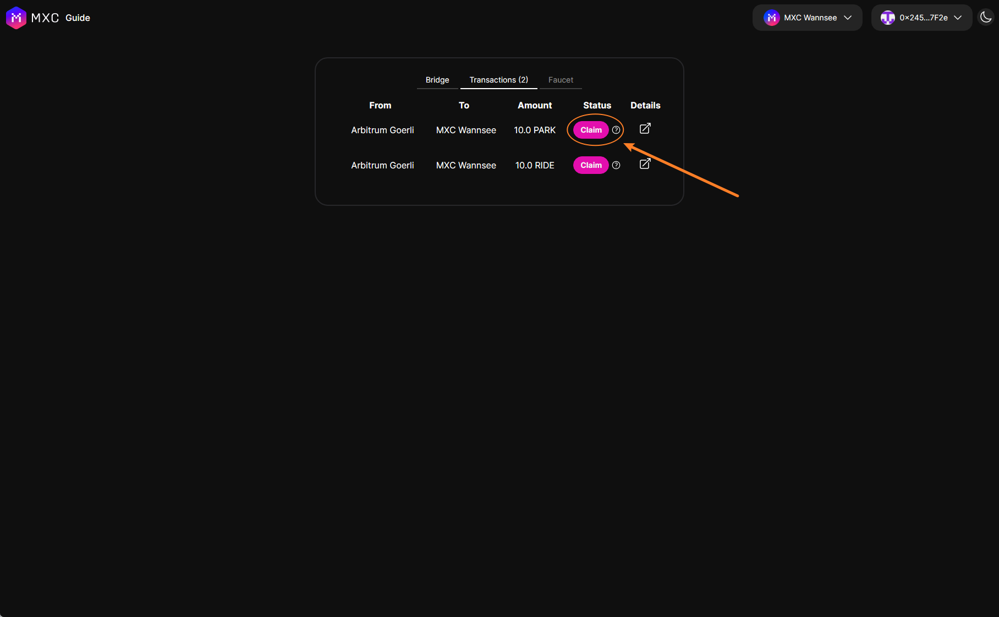

This guide will help you receive testnet tokens from the faucet(s).

> MXC token is the gas token of MXC (Wannsee testnet). The MXC token is used for paying L2 gas fee.

> The Ride token and Park token are both test tokens that are used for testing the bridge and swap.

## Prerequisites

- You have an Ethereum wallet address to accept the testnet tokens.

## Steps

### 1. Receive Goerli ETH on Arbitrum Goerli

### 2. Receive MXC, Ride, Park Test Token

Navigate to the [MXC Wannsee bridge](https://wannsee-bridge.mxc.com), select one of token from the dropdown, and click "Faucet" and Bridge to MXC Wannsee L2

### 3.  Receive MXC Test Token on MXC Wannsee L2

### 4. Claim the token on MXC Wannsee L2
