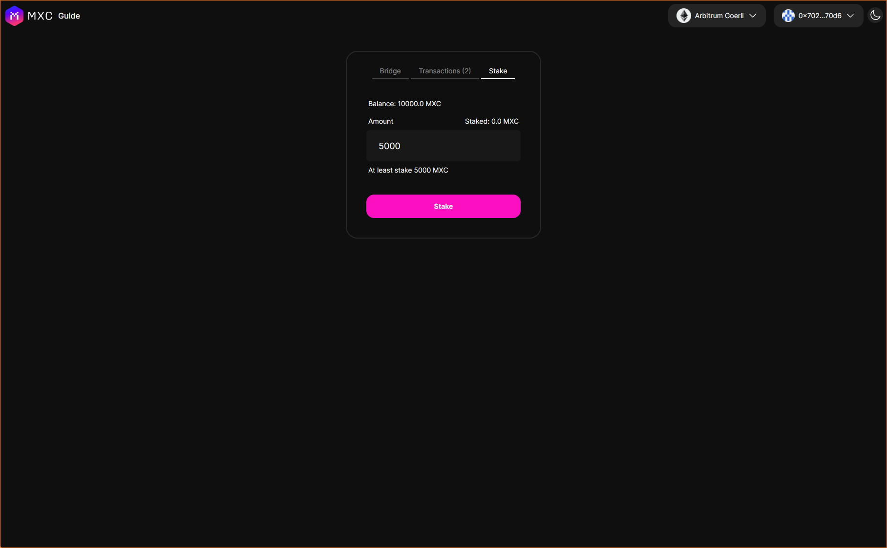
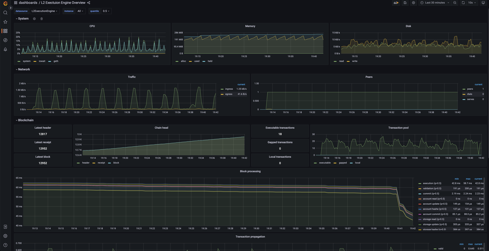

import Tabs from '@theme/Tabs';
import TabItem from '@theme/TabItem';

This guide will walk you through the process of operating a MXC supernode via [simple-mxc-node](https://github.com/MXCzkEVM/simple-mxc-node). You will be able to:

- Run a MXC supernode easily from the command line on Windows, Mac, and Linux.
- Run a MXC supernode regularly or as a prover.
- View a [Grafana](https://grafana.com/) dashboard which displays the node's status.

## Prerequisites

- Reserve some extra MXC as a fee for future proposed blocks.
- [Docker](https://docs.docker.com/engine/install/) is installed and **running**.
- [Git](https://github.com/git-guides/install-git/) is installed.
- Consult the [Geth minimum hardware requirements](https://github.com/ethereum/go-ethereum#hardware-requirements), with the exception of 1TB of free space (you won't need much, even ~50GB should suffice).
## Steps

### Staking MXC on MXCL1 contract
Staking Test MXC Token [here](https://wannsee-bridge.mxc.com/#/stake)



### Clone simple-mxc-node
```sh
git clone https://github.com/MXCzkEVM/simple-mxc-node
cd simple-mxc-node
```

### Configure your supernode (required)

First, copy the `.env.sample` to a new file `.env`:

```sh
cp .env.sample .env
```

Next, open the `.env` file in your preferred text editor:

<Tabs>
  <TabItem value="Mac" label="Mac" default>

      nano .env
  </TabItem>
  <TabItem value="Linux" label="Linux">

      vim .env
  </TabItem>
  <TabItem value="Windows" label="Windows">

      code .env
  </TabItem>
</Tabs>

Finally, set the following environment variables:

- L1_ENDPOINT_HTTP
- L1_ENDPOINT_WS

:::caution
You can get a Arbiturm L1 endpoint from a few places,
[QuickNode](https://www.quicknode.com/endpoints) are popular RPC providers. 
:::

**Make sure you select the RPC as Arbiturm Goerli testnet, and not Ethereum mainnet**.

### Enable your supernode as a prover (optional)

See [enable a prover](/docs/Tutorials/enable-a-prover) for more information.

### Start a supernode
:::caution
It may take some time to synchronize from the genesis block. You can monitor this progress through logs, or in the local grafana dashboard and see the latest L2 chain status in the [MXC Wannsee block explorer](https://wannsee-explorer.mxc.com/).
:::
Make sure Docker is running and then run the following command to start the supernode. If you want to run it in the background, please add the `-d` flag (`docker compose up -d`).

```sh
docker compose up
```

To run the supernode in the background (detached mode), use the `-d` flag:

```sh
docker compose up -d
```

### Stop a supernode

This command shuts down the supernode, but will keep all volumes, so next time you restart the supernode, it won't need to synchronize from the genesis again.

```sh
docker compose down
```

### Remove a supernode

These commands will completely remove the supernode by removing all volumes used by each container:

```sh
docker compose down -v
rm -f .env
```

### Update a supernode

Update the `simple-mxc-supernode` Docker images:

```sh
docker compose pull
```

### View the supernode's logs

To view the Docker logs, the following commands can be ran:

###### View all logs

```sh
docker compose logs -f
```

###### View the prover image's logs

```sh
docker compose logs -f mxc_client_prover_relayer
```

###### View the L2 execution engine logs

```sh
docker compose logs -f l2_execution_engine
```

###### View the live data streams of your running containers
This shows the CPU/MEM USAGE % and consumption of your machine's resources (add prefix "`docker stats -a`" to display all containers)
```sh
docker stats
```

### View the supernode's status dashboard

A [Grafana](https://grafana.com/) dashboard with a [Prometheus](https://prometheus.io/) datasource is also included to display the L2 execution engine's real time status. You can visit it at [http://localhost:3000/d/L2ExecutionEngine/l2-execution-engine-overview?orgId=1&refresh=10s](http://localhost:3000/d/L2ExecutionEngine/l2-execution-engine-overview?orgId=1&refresh=10s).




## Troubleshooting

### Supernode warning logs
You can ignore any WARN logs.

### Supernode error logs
#### `error: L1_STAKE_AMOUNT`
You need to stake 5000 MXC on MXCL1 contract to run a supernode as a proposer.

#### `error: L1_ID`
The block that you want to prove has already been verified, you can ignore this.

#### `error: L1_ALREADY_PROVEN`
This block has been proven by someone else, but its not verified yet, you can ignore it.

#### `Fatal: Failed to register the Ethereum service: database contains incompatible genesis`
Try to remove the supernode with `docker compose down -v` and then try again.

#### `Unhandled trie error: missing trie node`
You can ignore this error, it doesn't affect you and goes away after a while.

#### `Block batch iterator callback error; error="failed to fetch L2 parent block: not found`
You can ignore this error.

#### `Error starting ...: listen tcp4 0.0.0.0:{port} bind: address already in use`
The port is already in use by another service. You can either shut down the other program or change the port in the .env file.

#### `error parsing HTTP 403 response body: invalid character '<' looking for beginning of value`
Your IP address is being geo-blocked due to sanctions lists. If you're affected, try changing hosting locations or utilize a VPN to change your IP address.

#### `ERROR: The Compose file './docker-compose.yml' is invalid because: Unsupported config option for some_serivce 'pull_policy'`
Your docker installation is out of date. You need to update your docker compose installation: https://docs.docker.com/compose/install/.

#### `daemon docker is not running` <br></br> `Cannot connect to the Docker daemon`
Need to start the Docker before running the commands.

#### `database contains incompatible genesis`
