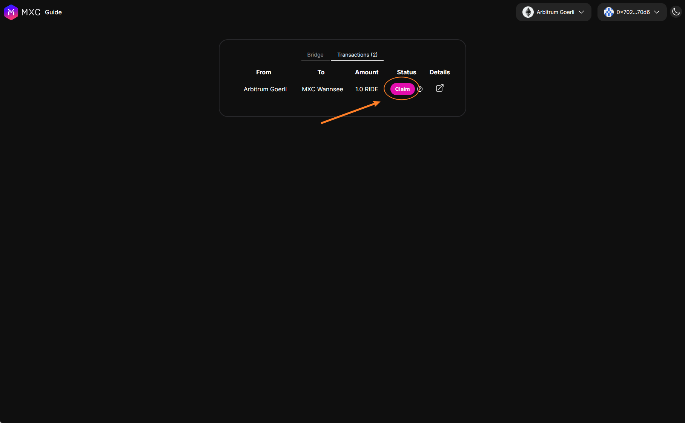

This guide will help you use the bridge to send tokens between Arbitrum Goerli and MXC (Wannsee testnet). You can read more about how bridging works [here](/docs/Designs/Bridge). 

> The Ride token and Park token are both dummy test tokens that are used for testing the bridge and swap.

## Prerequisites

- A wallet with some testnet ETH on Arbitrum Goerli and/or MXC Wannsee (you can [receive tokens here](/docs/Tutorials/receive-tokens)).

## Steps 

### Visit the bridge
Visit the [bridge](https://wannsee-bridge.mxc.com/) and the UI should be intuitive.

### Bridge tokens from Arbitrum Goerli to MXC Wannsee
Try bridging MXC, RIDE, PARK from Arbitrum Goerli to MXC Wannsee. You can also try manually claiming the transfer yourself by clicking the "Claim" button under the "Transactions" tab.

### Bridge tokens from MXC Wannsee to Arbitrum Goerli
Try bridging MXC, RIDE, PARK from MXC Wannsee to Arbitrum Goerli . You can also try manually claiming the transfer yourself by clicking the "Claim" button under the "Transactions" tab.
